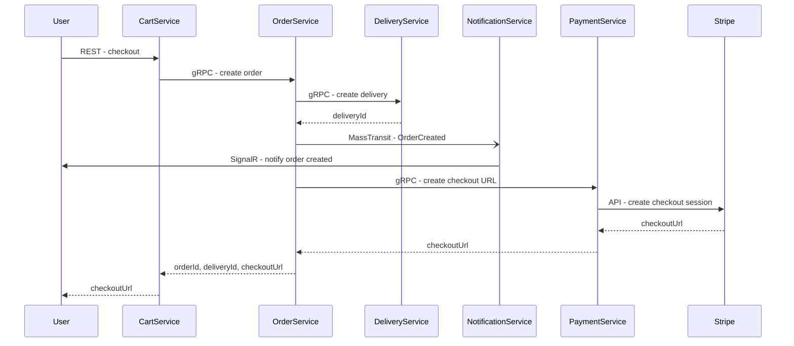
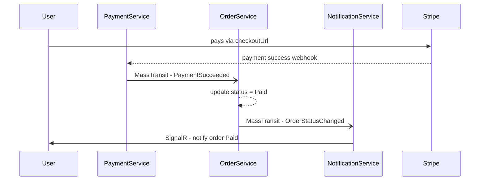

# ECommerceApp


ECommerceApp is a backend e-commerce application built with a microservices architecture.  
Each service has a well-defined domain responsibility and they communicate with each other via gRPC, MassTransit (RabbitMQ/Azure Service Bus), and SignalR for real-time notifications.  
The project is designed and deployed in **Azure Container Apps**, using **Azure SQL Database** and **Azure Service Bus**.

## Tech Stack

### Back-end
- .NET 9  
- SignalR  
- gRPC  
- MassTransit, RabbitMQ, Azure Service Bus  
- EF Core  
- ASP.NET Core Identity  
- JWT  

### Deployment
- Docker, Azure Container Apps  
- Prepared YAML files for Kubernetes (k8s)  

### Database
- Azure SQL  

### CI/CD Pipeline
The project includes a fully automated CI/CD pipeline using **GitHub Actions**:

- **Build & Test** – On every push to `main` or when opening a pull request, the project is built and all unit and integration tests are executed.  
- **Docker Build & Push** – A Docker image is built for each microservice and pushed to the GitHub Container Registry (GHCR).  
- **Deploy** – After a successful build, the latest images are automatically deployed to **Azure Container Apps**.  

## Project Structure

### CartService
- Responsible for creating carts, managing cart items, and cart checkout  

### DeliveryService
- Simulates a delivery service with a courier  

### NotificationService
- Responsible for sending notifications to the user  
- Uses SignalR  

### OrderService
- Responsible for creating and managing orders  
- Orchestrates communication with PaymentService, DeliveryService, and NotificationService  

### PaymentService
- Responsible for integrating with the Stripe payment service  
- Creates checkout URLs and handles Stripe responses after successful payments  

### ProductService
- Responsible for managing products, brands, categories, and reviews  

### UserService
- Responsible for user management, authentication, and JWT generation  

### Tests
- Contains positive and negative xUnit tests for all services and controllers
- All tests are also executed automatically in the CI/CD pipeline
- **300 xUnit tests in total**  
- Integration tests cover critical application flows  
- **29 integration tests in total**  

## API Documentation (Swagger)

| Service             | Swagger UI |
|---------------------|------------|
| CartService         | [Swagger](https://cartservice.gentleplant-c909a9be.westeurope.azurecontainerapps.io/swagger) |
| DeliveryService     | [Swagger](https://deliveryservice.gentleplant-c909a9be.westeurope.azurecontainerapps.io/swagger) |
| NotificationService | [Swagger](https://notificationservice.gentleplant-c909a9be.westeurope.azurecontainerapps.io/swagger) |
| OrderService        | [Swagger](https://orderservice.gentleplant-c909a9be.westeurope.azurecontainerapps.io/swagger) |
| PaymentService      | [Swagger](https://paymentservice.gentleplant-c909a9be.westeurope.azurecontainerapps.io/swagger) |
| ProductService      | [Swagger](https://productservice.gentleplant-c909a9be.westeurope.azurecontainerapps.io/swagger) |
| UserService         | [Swagger](https://userservice.gentleplant-c909a9be.westeurope.azurecontainerapps.io/swagger) |

## Features
- Decoupled microservices communicating via gRPC and RabbitMQ/Azure Service Bus  
- User management  
- User registration and login (JWT authentication)  
- Product, brand, category, and product review management  
- Add products to cart and checkout  
- Payments via Stripe (Checkout Session)  
- Order creation and delivery handling  
- Order and delivery status management  
- Real-time notifications when an order is created, status changes, or delivery is canceled (SignalR)  
- Automated tests (300 xUnit, 29 integration)  

## Stripe
- Integration with the Stripe payment service  
- Checkout URL creation  
- WebHook handling for successful payments  

### Testing in Sandbox Mode
- Test card number for successful payment: `4242424242424242`  
- Other fields can be random values  
- [Stripe Documentation](https://docs.stripe.com/checkout/quickstart)  

## Running the Project Locally

### Requirements
- .NET 9 SDK  
- Docker + Docker Compose  
- SQL Server database (recommended to run in Docker)  

### Steps

#### 1) Clone the repository:
```bash
git clone https://github.com/JakubKopecky-dev/ECommerceApp.git   
cd ECommerceApp
```

#### 2) Run the application using Docker Compose:
```bash
docker-compose up -d --build
```

#### 3) After starting, the services are available here:
| Service               | URL / Swagger UI |
|------------------------|------------------|
| CartService            | [Swagger](http://localhost:7125/swagger) |
| DeliveryService        | [Swagger](http://localhost:7126/swagger) |
| NotificationService    | [Swagger](http://localhost:7127/swagger) |
| OrderService           | [Swagger](http://localhost:7128/swagger) |
| PaymentService         | [Swagger](http://localhost:7129/swagger) |
| ProductService         | [Swagger](http://localhost:7130/swagger) |
| UserService            | [Swagger](http://localhost:7131/swagger) |
| RabbitMQ Management UI | [http://localhost:15672](http://localhost:15672) (user: `guest`, pass: `guest`) |
| SQL Server             | `localhost,1433` (user: `sa`, password: `ECom2025!Pass`) |

#### 4) Configuration
- Configurations are set in `docker-compose.yml`
> ⚠️ Credentials (e.g. SQL password or Stripe keys) are only for local usage.  
> In production, it is recommended to use **Azure Key Vault** or **Application settings / Environment variables** in Azure Container Apps.

#### 5) Running tests

##### Run all tests
```bash
dotnet test
```

##### Run all unit tests
``` bash
dotnet test --filter Category=Unit
```

##### Run all integration tests
``` bash
dotnet test --filter Category=Integration
```


## Main Workflow
### 1) Create Order



### 2) Successful Payment



## 📬 Contact
**Jakub Kopecký**  
 [🌐 GitHub](https://github.com/JakubKopecky-dev)  
 [💼 LinkedIn](https://www.linkedin.com/in/jakub-kopeck%C3%BD-a5919b278/)  
